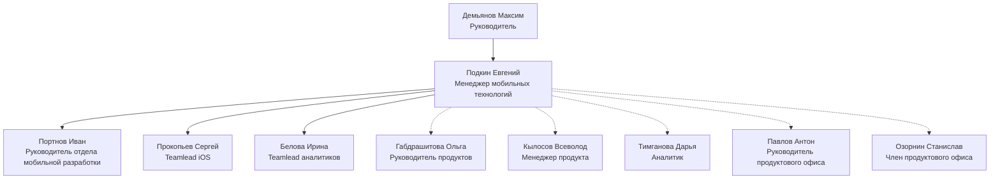

# Карта связей

```mermaid
graph TD
    mdemyanov["Демьянов Максим<br/>Руководитель"] --> epodkin["Подкин Евгений<br/>Менеджер мобильных технологий"]
    epodkin --> iportnov["Портнов Иван<br/>Руководитель отдела мобильной разработки"]
    epodkin --> sprokopiev["Прокопьев Сергей<br/>Teamlead iOS"]
    epodkin --> ibelova["Белова Ирина<br/>Teamlead аналитиков"]
    epodkin -.-> ogabdrashitova["Габдрашитова Ольга<br/>Руководитель продуктов"]
    epodkin -.-> vkilosov["Кылосов Всеволод<br/>Менеджер продукта"]
    epodkin -.-> dtimganova["Тимганова Дарья<br/>Аналитик"]
    epodkin -.-> apavlov["Павлов Антон<br/>Руководитель продуктового офиса"]
    epodkin -.-> sozornin["Озорнин Станислав<br/>Член продуктового офиса"]
```
