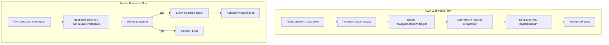
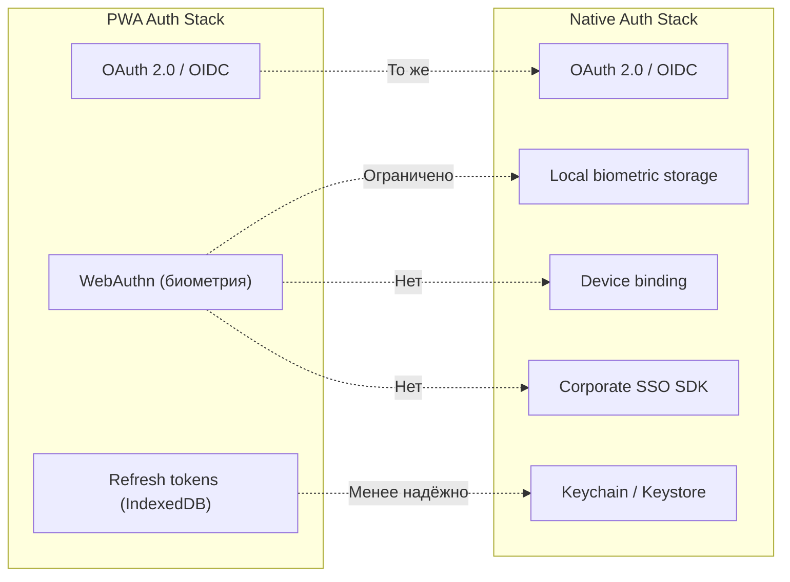

---

## 📊 Сводная таблица возможностей

| Категория | Возможность | PWA | Натив | Комментарий |
|-----------|-------------|-----|-------|-------------|
| **Уведомления** | Push-уведомления (Android) | ✅ | ✅ | Паритет |
| | Push-уведомления (iOS) | ⚠️ | ✅ | Требуется add to Home Screen |
| | Silent push | ❌ | ✅ | Нет фоновой синхронизации |
| **Офлайн-работа** | Кеширование данных | ✅ | ✅ | IndexedDB / Cache API |
| | Создание офлайн | ✅ | ✅ | Очередь синхронизации |
| | Размер хранилища | ⚠️ | ✅ | iOS: ~50-500MB на домен |
| | Фоновая синхронизация | ❌ | ✅ | Только при открытом приложении |
| **Геолокация** | Активная геолокация | ✅ | ✅ | При открытом приложении |
| | Фоновая геолокация | ❌ | ✅ | Не поддерживается |
| **Камера** | Съемка фото | ✅ | ✅ | Через input capture |
| | Запись видео | ❌ | ✅ | Только через системное приложение |
| | Доступ к галерее | ✅ | ✅ | Через input |
| **Коммуникация** | VoIP звонки | ❌ | ✅ | Невозможны в PWA |
| | SMS/RCS | ❌ | ✅ | Нет доступа |
| **Интеграция с ОС** | Deep links | ✅ | ✅ | Работают |
| | Голосовые ассистенты | ❌ | ✅ | Нет интеграции |
| **AI и голос** | Локальные AI-модели | ⚠️ | ✅ | WebGPU/WASM медленнее |
| | Speech-to-Text | ⚠️ | ✅ | Web Speech API ограничен |
| | Text-to-Speech | ⚠️ | ✅ | Web Speech API ограничен |
| **Безопасность** | Биометрия | ⚠️ | ✅ | WebAuthn: требуется подтверждение каждый раз, нет silent re-auth, нет iframe на iOS |
| | MFA/SSO | ⚠️ | ✅ | Нет корпоративного SSO, нет Certificate auth, ограниченная интеграция с менеджерами паролей |
| | PIN-код | ✅ | ✅ | Паритет |

---

## 🔴 Критические ограничения PWA

| Ограничение | Влияние на бизнес |
|-------------|-------------------|
| **Фоновая геолокация** | Нет трекировки специалистов на карте в реальном времени |
| **Запись видео** | Невозможна видео-фиксация без переключения в камеру |
| **Офлайн-данные** | При очистке кэша пользователем могут потеряться все данные офлайн-режима |
| **Push на iOS** | Менее надежные уведомления, нет badge count |

---

## 🔄 Гибридная стратегия

Возможен комбинированный подход для разных ролей:

```
┌─────────────────────────────────────────────────────────────┐
│                     Гибридная платформа                      │
├──────────────────────┬──────────────────────────────────────┤
│   PWA (внутренние)   │   Натив (выездные специалисты)       │
├──────────────────────┼──────────────────────────────────────┤
│ • Просмотр объектов   │ • Офлайн-работа                      │
│ • Создание запросов   │ • Фото/видео фиксация               │
│ • Базовые уведомления │ • Push-уведомления (полноценные)    │
│ • Редактирование      │ • Фоновая геолокация                │
│ • Комментарии         │                                     │
└──────────────────────┴──────────────────────────────────────┘
```

---

## 💡 Рекомендации по выбору платформы

| Сценарий | Рекомендация |
|----------|--------------|
| **Выездные специалисты** | Нативное приложение |
| **Внутренние сотрудники (офис)** | PWA допустимо |
| **Требуется офлайн-работа** | Нативное приложение преимущественно |
| **Требуется видео-фиксация** | Нативное приложение обязательно |

---

## 🔐 Аутентификация в PWA — ограничения и специфика

### Биометрическая аутентификация (WebAuthn)

| Ограничение | Описание | Влияние |
|-------------|----------|---------|
| **Нет persistent auth** | Ключ привязан к origin, но требует UI-подтверждения при каждом вызове | Невозможна прозрачная re-auth без действия пользователя |
| **Нет silent re-auth** | Биометрия требует явного подтверждения (Face ID / Touch ID) каждый раз | Плохой UX для частых операций |
| **iOS: нет iframe** | WebAuthn не работает в iframe на iOS | Нельзя встроить auth в модальное окно |
| **Ограниченный идентификатор** | Device ID недоступен — только credential ID | Невозможно привязать сессию к конкретному устройству без дополнительных токенов |
| **Нет SDK-интеграции** | Нельзя использовать нативные биометрические промпты (например, banking-style) | UX хуже, чем в нативе |



### MFA (Multi-Factor Authentication)

| Ограничение | Описание |
|-------------|----------|
| **Нет TOTP генерации в фоне** | Невозможно генерировать коды без открытия PWA |
| **Нет push-подтверждений** | Нельзя отправить push для подтверждения входа на другом устройстве |
| **Нет hardware token** | FIDO2 security keys работают только через USB/NFC, не Bluetooth |
| **Ограниченный SMS auto-fill** | Работает только в Safari, не в standalone PWA на iOS |
| **Нет fallback на biometric** | Нельзя настроить биометрию как второй фактор для корпоративных аккаунтов |

### SSO (Single Sign-On)

| Ограничение | Описание | Workaround |
|-------------|----------|------------|
| **Нет Certificate Authentication** | Невозможно использовать клиентские сертификаты для SSO | OAuth 2.0 / OIDC |
| **Нет Kerberos/NTLM** | Невозможна интеграция с Windows AD напрямую | Reverse-proxy с аутентификацией |
| **Нет корпоративного SSO** | Нет интеграции с Microsoft Authenticator / Google Enterprise | Browser-based SAML/OAuth flow |
| **Ограниченный Credential Manager** | На iOS нет интеграции с iCloud Keychain для PWA | Использовать Sign in with Apple |
| **Нет device binding** | Невозможно привязать аккаунт к устройству на уровне ОС | Хранить refresh token в IndexedDB |

### Сравнение с нативным подходом



### Риски для корпоративного использования

| Риск | Описание | Митигация |
|------|----------|-----------|
| **Сессия теряется при очистке** | IndexedDB стирается при очистке данных сайта | Частое обновление refresh tokens |
| **Нет device trust** | Невозможно отозвать доступ с конкретного устройства | Short-lived tokens + принудительный re-auth |
| **Фишинг в Web** | PWA работает в браузере, уязвима к фишинговым сайтам | WebAuthn с origin binding |
| **Нет MDM integration** | Невозможно управлять credentials через MDM | Использовать containerized browsers |
| **Ограниченный audit** | Нет логов на уровне устройства | Server-side audit logs

### Когда PWA-аутентификация достаточна

| Сценарий | Почему работает |
|----------|-----------------|
| **Внутренние сотрудники** | Доступ через корпоративную сеть, IP whitelist |
| **Низкий риск данных** | Нет чувствительной PII или финансовых данных |
| **Compliance не требует device binding** | Нет требований GDPR/HIPAA к привязке устройства |
| **Kiosk режим** | Фиксированные устройства, контролируемая среда |

---

