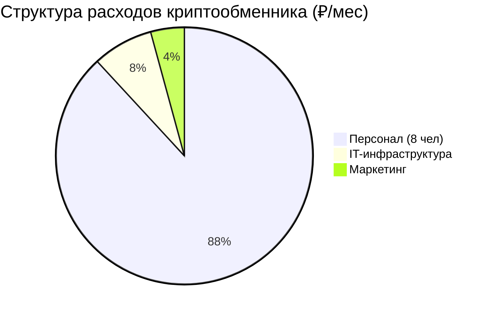

# Анализ инфраструктуры криптообменника

**Источник:** Bizavi.ru (объявление о продаже бизнеса)
**Дата публикации:** 27 июня 2024 г.
**ID объявления:** 884

---

## Краткое описание

Продается действующий криптообменник, размещённый на агрегаторе BestChange. Бизнес работает 5 лет, имеет собственную уникальную IT-инфраструктуру и методологию работы.

---

## Финансовые показатели

| Показатель | Значение |
|------------|----------|
| **Чистая прибыль** | 1 807 000 ₽/мес (~21,7 млн ₽/год) |
| **Цена продажи** | 30 000 000 ₽ |
| **Окупаемость** | 17 месяцев |
| **Статус** | Уже на BestChange (99,9% трафика) |

---

## IT-инфраструктура

### Программное обеспечение

- **База:** 1С (Enterprise)
- **Фундамент:** Premium Exchanger
- **Тип:** Собственная надстройка ("найстройка" над Premium Exchanger)
- **Уникальность:** 5-летний опыт работы встроен в софт

### Ключевые возможности ПО

1. **Мониторинг конкурентов в реальном времени**
   - Отслеживание всех комиссий конкурентов по всем направлениям
   - Автоматическая подстройка под рыночные условия
   - Оперативность — преимущество перед конкурентами

2. **Умное ценообразование**
   - Динамическая корректировка спредов
   - Баланс между конкурентоспособностью и маржинальностью

### Техническая инфраструктура (80-100 тыс. ₽/мес)

| Компонент | Стоимость | Описание |
|-----------|-----------|----------|
| Сервера / VPS / VPN | 60 тыс. ₽/мес | Основная инфраструктура |
| Сайт (домен + хостинг) | 20 тыс. ₽/мес | Онлайн-чат, оплата скрипта |
| Ситуативные расходы | 20 тыс. ₽/мес | Прочие IT-расходы |

**Итого:** ~90 тыс. ₽/мес на IT-инфраструктуру

---

## Команда

### Штатная структура (8 человек)

| Должность | Кол-во | Оклад | Итого/мес |
|-----------|--------|-------|-----------|
| Директор | 1 | 200 тыс. ₽ | 200 тыс. ₽ |
| IT-специалист | 1 | 150 тыс. ₽ | 150 тыс. ₽ |
| Администраторы | 2 | 120 тыс. ₽ | 240 тыс. ₽ |
| Операторы | 2 | 80 тыс. ₽ | 160 тыс. ₽ |
| Курьеры (Москва) | 2 | 120 тыс. ₽ | 240 тыс. ₽ |
| **ИТОГО** | **8** | — | **1 040 тыс. ₽** |

### Распределение ролей

- **IT-специалист:** Критически важная роль (поддержка софта, мониторинг)
- **Операторы:** Обработка заявок, общение с клиентами
- **Администраторы:** Верификация, AML/KYC
- **Курьеры:** Наличные операции (Москва)
- **Директор:** Управление, стратегия

---

## Маркетинг и трафик

### Основной канал: BestChange

- **Доля трафика:** 99,9%
- **Порог входа:** 9 кругов ада (сложная процедура аккредитации)
- **Стоимость входа:** Высокая (строгие требования)

### Оптимизация расходов на реферальную систему

| Период | Расходы |
|--------|---------|
| Раньше | $3-5K в месяц |
| Сейчас | $500-600 в месяц |

**Как добились:** Разработали собственную систему оптимизации реферальных расходов. Это практикуется и другие крупные обменники.

### Итого маркетинг: 40-60 тыс. ₽/мес

---

## Полная структура расходов (мес)

**Всего расходов:** ~1,18 млн ₽/мес
**Чистая прибыль:** 1,8 млн ₽/мес
**Рентабельность:** ~152%

---

## Что входит в продажу

1. ✅ Обменник, уже размещённый на BestChange
2. ✅ Настроенная инфраструктура (сервера, VPN, хостинг, 1С)
3. ✅ Telegram-бот
4. ✅ Обучение и сопровождение (2 месяца)
5. ✅ Уникальная методология работы
6. ✅ Все юридические документы готовы

---

## Ключевые инсайты

### 1. BestChange — монополист трафика
> 99,9% клиентов приходят из BestChange. Остальные каналы не имеют значения.

### 2. ПО — конкурентное преимущество
> Собственный софт на базе 1С с автоматическим мониторингом конкурентов даёт преимущество в скорости реакции на рынок.

### 3. Маркетинг можно оптимизировать
> От $5K до $600 в месяц — разница в 8+ раз за счёт собственной реферальной системы.

### 4. Минимальная IT-инфраструктура
> Нет дорогого железа на балансе. Всё в аренде (VPS, VPN, хостинг).

### 5. Порог входа в BestChange очень высокий
> 9 кругов ада аккредитации. Это защищает от мелких конкурентов.

---

## Контакт продавца

- **Брокер:** Московский Бизнес Брокеридж (МББ)
- **Контакт:** +7-909-163-11-11
- **Email:** MosBizBroker@mail.ru
- **Город:** Москва, Восточный АО

---

## Метаданные

- **Дата парсинга:** 8 мая 2026 г.
- **API endpoint:** https://admin.bizavi.ru/api/v1/publications/884
- **Статус объявления:** В продаже
