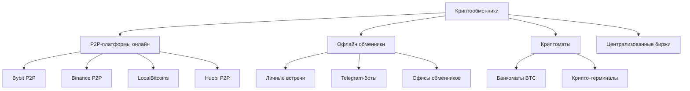

# Обзор рынка криптообменников в России

**Дата исследования:** 26.04.2026
**Цель:** Изучить контекст криптовалюты и работы оффлайн криптообменников для проекта Naumen

---

## 1. Типы криптообменников



### 1.1. P2P-платформы (онлайн)

**Как работают:**
- Платформа выступает гарантом сделки
- Пользователь создаёт заявку на покупку/продажу крипты
- Другой пользователь принимает заявку
- Платформа удерживает средства (эскроу) до подтверждения
- После успешной сделки средства разблокируются

**Основные игроки:**
- Bybit P2P — популярный в России благодаря географии
- Binance P2P — самый крупный, но ограниченный доступ из РФ
- LocalBitcoins — один из старейших
- Huobi P2P — менее популярный

**Комиссии и бизнес-модель:**
- Комиссия платформы: обычно 0.5-1% от суммы сделки
- Спред: разница между курсом покупки и продажи (1-3%)
- Комиссия за вывод: 0.1-0.5%

### 1.2. Офлайн обменники

**Как работают:**
- Личная встреча в общественном месте (кафе, торговый центр)
- Передача наличных в обмен на криптовалюту через кошелёк
- Обменник может требовать подтверждение личности
- Процесс занимаем от 15 до 60 минут

**Где ищут:**
- Telegram-каналы и группы
- Форумы (Bitcointalk, профильные сообщества)
- Сарафанное радио
- Специализированные агрегаторы (BestChange)

**Риски офлайн обменов:**
- Физическая опасность при личных встречах
- Мошенничество (поддельные купюры, отмена транзакции)
- Отсутствие юридической защиты
- Возможная связь с теневым бизнесом

### 1.3. Криптоматы

**Как работают:**
- Автоматизированные терминалы для покупки/продажи крипты
- Принимают наличные, выдают крипту на кошелёк
- Иногда позволяют обменять крипту на наличные

**Особенности в России:**
- Единичные установки в крупных городах
- Высокие комиссии (5-10%)
- Небольшие лимиты на транзакции
- Регуляторные сложности

---

## 2. Бизнес-модель криптообменников

### 2.1. Основные источники дохода

| Источник | Описание | Размер |
|----------|----------|--------|
| **Спред** | Разница между курсом покупки и продажи | 1-3% |
| **Комиссия платформы** | Процент от суммы сделки | 0.5-1% |
| **Комиссия за вывод** | За перевод крипты с платформы | 0.1-0.5% |
| **Лимиты для VIP** | Повышенные лимиты за подписку | Месячная плата |

### 2.2. Типичная модель P2P-обменника

```
Курс рынка BTC: 100 000 ₽

Комиссия платформы: 0.5%
Спред обменника: 2%

Курс покупки у клиента: 98 000 ₽
Курс продажи клиенту: 102 000 ₽

Прибыль с оборота 1 млн ₽:
- Спред: 2% × 1 000 000 = 20 000 ₽
- Комиссия платформы: 0.5% × 1 000 000 = 5 000 ₽
- Итого: 25 000 ₽ с оборота
```

---

## 3. Целевая аудитория

### 3.1. Профили пользователей

| Сегмент | Описание | Сценарии |
|----------|----------|-----------|
| **Инвесторы** | Долгосрочное хранение криптоактивов | Покупка на сбережения, HODL |
| **Трейдеры** | Краткосрочная торговля | Активная покупка/продажа, спекуляции |
| **Фрилансеры** | Получение дохода в крипте | Обмен крипты на рубли |
| **Бизнес** | Оплата услуг/товаров | Проведение международных расчётов |
| **Гrey-сектор** | Обход санкций, теневая экономика | Обналичивание, вывод средств |
| **Новички** | Первая покупка крипты | Обучение, пробные операции |

### 3.2. Зачем используют криптообменники

1. **Обналичивание** — крипта → рубли наличными
2. **Приватность** — минимальный след, отсутствие KYC в офлайн
3. **Скорость** — мгновенный обмен без банковских процедур
4. **Доступность** — работают там, где нет доступа к биржам
5. **Обход ограничений** — санкции, блокировки банковских карт
6. **Анонимность** — для тех, кто не хочет связывать себя с криптой

---

## 4. Конкурентная среда

### 4.1. Основные игроки на российском рынке

**P2P-платформы:**
- Bybit P2P — лидер по географии РФ
- Binance P2P — глобальный лидер, но ограничен в РФ
- LocalBitcoins — исторический лидер, менее активен

**Агрегаторы обменников:**
- BestChange — самый популярный агрегатор
- CryptoExchanger — альтернатива BestChange
- 60cek — менее популярный агрегатор

**Офлайн обменники:**
- Десятки индивидуальных обменников в Telegram
- Локальные сообщества в городах
- Нет единого бренда

### 4.2. Факторы конкуренции

| Фактор | Описание |
|--------|----------|
| **Курс/спред** | Чем ниже спред, тем привлекательнее |
| **Лимиты** | Высокие лимиты для крупных операций |
| **Скорость** | Мгновенный обмен важен |
| **Репутация** | Отзывы, возраст аккаунта, подтверждения |
| **География** | Наличие в нужном городе/регионе |
| **Удобство** | Простой интерфейс, быстрый контакт |
| **Поддержка** | Отзывчивость при проблемах |

### 4.3. Как выбирают обменника

1. **Курс и комиссия** — главное для большинства
2. **Рейтинг и отзывы** — критично для офлайн
3. **Лимиты** — важны для крупных сумм
4. **Условия сделки** — способы оплаты, время ответа
5. **Личные связи** — для постоянных клиентов

---

## 5. Законодательство РФ о криптовалютах

### 5.1. Текущий статус (2026)

| Аспект | Статус |
|--------|--------|
| **Владение криптой** | Легально (физические лица) |
| **Майнинг** | Регулируется (закон № 259-ФЗ) |
| **Криптообмен как бизнес** | Серая зона, не регламентирован |
| **Оплата криптой** | Запрещено для юридических лиц |
| **Крипто-платежи** | Не запрещены напрямую, но сложно реализуемы |

### 5.2. Закон № 259-ФЗ (О цифровых финансовых активах)

**Что регулирует:**
- Майнинг криптовалют
- Цифровые финансовые активы (ЦФА)
- Система учёта майнеров

**Требования для майнеров:**
- Регистрация в реестре при потреблении > 6000 кВт·ч/месяц
- ИП или юрлицо
- Специальный счёт для расчётов
- Отчётность о майнинге

### 5.3. Проект закона "О цифровой валюте" (апрель 2026)

**Статус:** принят в первом чтении

**Основные положения:**
- Определение правового статуса криптовалют
- Регулирование криптообменников
- Требования к операторам криптовалютной инфраструктуры
- Налогообложение операций с криптой

**Ожидаемые последствия:**
- Легализация криптообменников как бизнеса
- Требования к KYC/AML
- Налогообложение прибыли
- Лицензирование деятельности

### 5.4. Риски для бизнеса

| Риск | Описание |
|------|----------|
| **Непрозрачность** | Требования к бизнесу пока не определены |
| **Налогообложение** | Может стать невыгодным |
| **KYC/AML** | Усложнит офлайн обмены |
| **Конкуренция с банками** | Банки могут войти на рынок |

---

## 6. ПО, используемое криптообменниками

### 6.1. Основные типы ПО

| Тип | Назначение | Примеры |
|-----|------------|----------|
| **Кошельки** | Хранение крипты | MetaMask, Trust Wallet, Exodus |
| **Биржевые интерфейсы** | Торговля, P2P | Binance, Bybit, OKX |
| **Трекеры портфелей** | Мониторинг активов | CoinStats, Delta |
| **Агрегаторы курсов** | Сравнение обменников | BestChange, CryptoExchanger |
| **Мессенджеры** | Связь с клиентами | Telegram, WhatsApp |
| **Excel/Google Sheets** | Учёт операций | Ручное ведение |

### 6.2. Основные потребности в ПО

1. **Учёт сделок** — фиксация всех транзакций
2. **Курсы и лимиты** — актуальная информация
3. **Коммуникация** — быстрый контакт с клиентами
4. **Безопасность** — 2FA, хранение ключей
5. **Аналитика** — прибыльность, обороты, статистика
6. **Автоматизация** — уведомления, повторяющиеся операции

---

## 7. Выводы для проекта Naumen

### 7.1. Основные инсайты

1. **Рынок неформализован** — большинство обменников работают в Telegram без систем
2. **Потребность в учёте** — каждый ведёт учёт вручную
3. **Коммуникация в мессенджерах** — Telegram — основная платформа
4. **Критично для оффлайн** — безопасность, репутация, лимиты
5. **Законодательство меняется** — в 2026 ожидается легализация

### 7.2. Потенциальные боли клиента

| Боль | Описание |
|------|----------|
| **Ручной учёт** | Excel, потеря данных, ошибки |
| **Связь** | Клиенты в Telegram, перепутывание диалогов |
| **Репутация** | Негативные отзывы, отсутствие единого рейтинга |
| **Безопасность** | Мошенничество, кража средств |
| **Лимиты** | Нельзя быстро увеличить для проверенных клиентов |
| **Налоги** | Сложно посчитать прибыль и отчитаться |

### 7.3. Возможные функции модуля

1. **CRM для клиентов** — учёт контактов, история сделок
2. **Автоматический учёт** — фиксация всех транзакций
3. **Управление лимитами** — уровни доверия клиентов
3. **Telegram-интеграция** — уведомления, быстрые ответы
4. **Курсы и спреды** — автоматический расчёт
5. **Аналитика и отчёты** — прибыльность, оборот
6. **Оценка рисков** — проверка контрагента, скоринг
7. **Готовность к закону** — KYC, налоги

---

## 8. Следующие шаги

1. Провести интервью с реальными криптообменниками
2. Изучить текущие решения на рынке
3. Определить MVP-функционал
4. Получить от Михаила Черешнева контакты для кастедевов
5. Провести кастедевы с потенциальными клиентами

---

## Источники

- Обзор рынка P2P-обменников (аналитические материалы)
- Закон № 259-ФЗ "О цифровых финансовых активах"
- Проект закона "О цифровой валюте" (первое чтение, апрель 2026)
- Агрегатор BestChange (рыночная конъюнктура)
- Сообщество @crypto на vc.ru

---

**Примечание:** Исследование основано на общих знаниях о рынке криптовалют. Для принятия решений рекомендуется провести дополнительные интервью с реальными криптообменниками и изучить их текущие процессы.
