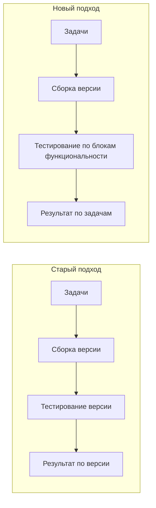

# DEC-0001: Изменить подход к тестированию Mobile SDK 2.0

**Дата:** 01.04.2026
**Статус:** ✅ Принято
**Проект:** [[30_PROJECTS/active/ncc/ncc|NCC]]
**Категория:** Процесс / Тестирование
**Влияние:** Высокое
**Спонсор решения:** [[10_PEOPLE/epodkin/epodkin|Подкин Евгений]]

---

## Контекст

### Проблема

Текущий подход к тестированию Mobile SDK 2.0 имеет ряд проблем:

1. **ТестированиеByVersion** — тестировщик тестирует целиком версию, а не отдельные задачи
2. **Непрозрачность прогресса** — сложно понять статус конкретной задачи в версии
3. **Длительный цикл обратной связи** — тестирование версии занимает ~5 рабочих дней
4. **Сложность курирования дефектов** — дефект привязан к версии, а не к задаче

### Последствия

| Проблема | Последствие |
|----------|-------------|
| Тестирование версиями | Невозможно показать прогресс по задачам |
| Дефекты к версии | Сложно определить ответственного за задачу |
| Длительный цикл | Задержка обратной связи для разработчиков |

---

## Решение

**Изменить подход к тестированию:**

### Изменения

| Аспект | Было | Стало |
|--------|------|-------|
| Единица тестирования | Версия целиком | **Версия + блоки функциональности** |
| Привязка дефектов | К версии | **К задаче** |
| Прозрачность | Только по версиям | **По задачам и блокам** |
| Обратная связь | После версии (~5 дней) | **По мере готовности блоков** |

---

## Обоснование

1. **Запрос стейкхолдеров** — Марк Бутенко запросал прозрачность прогресса по задачам
2. **Эффективность** — быстрее обнаружение проблем на уровне задач
3. **Управление рисками** — яснее понимать, какие задачи блокируют релиз
4. **Коммуникация** — проще объяснять статус заказчику

---

## Альтернативы

| Вариант | Плюсы | Минусы | Почему не выбран |
|---------|-------|--------|------------------|
| **Оставить как есть** | Нет изменений | Непрозрачно, риск срыва сроков | Не устраивает стейкхолдеров |
| **Тестировать только по задачам** | Максимальная прозрачность | Потеря целостности версии | Нужен баланс |
| **✅ Новый подход** | Баланс прозрачности и целостности | Требует перестройки процессов | **Оптимально** |

---

## План реализации

| Шаг | Действие | Ответственный | Срок |
|-----|----------|---------------|------|
| 1 | Описать новую модель тестирования | [[10_PEOPLE/epodkin/epodkin|Подкин Е.]] | До 04.04.2026 |
| 2 | Согласовать с командой (Иван, Сергей) | [[10_PEOPLE/epodkin/epodkin|Подкин Е.]] | До 04.04.2026 |
| 3 | Обновить процесс в UP | [[10_PEOPLE/epodkin/epodkin|Подкин Е.]] | После согласования |
| 4 | Внедрить на следующей версии | Иван Портнов, Сергей Прокопьев | Следующий спринт |

---

## Риски

| Риск | Митигация |
|------|-----------|
| Сопротивление команды | Обсуждение и согласование |
| Увеличение нагрузки на тестировщика | Оценка labourhood перед внедрением |
| Сложности с интеграцией в UP | Координация с Марком Бутенко |

---

## Метрики успеха

- [ ] Прозрачность прогресса по задачам в роадмапе
- [ ] Сокращение времени обратной связи при тестировании
- [ ] Удовлетворённость стейкхолдеров статусной отчётностью

---

## Связанные документы

- [[20_MEETINGS/ktalk/2026-04-01_Mobile-SDK-2.0-Промежуточный-итог]] — Встреча, где принято решение
- [[30_PROJECTS/active/ncc/ncc|NCC]] — Проект Mobile SDK 2.0

---

## История изменений

| Дата | Изменение |
|------|-----------|
| 01.04.2026 | Решение принято на встрече с заказчиками |
| 07.04.2026 | Создан Decision Record |
