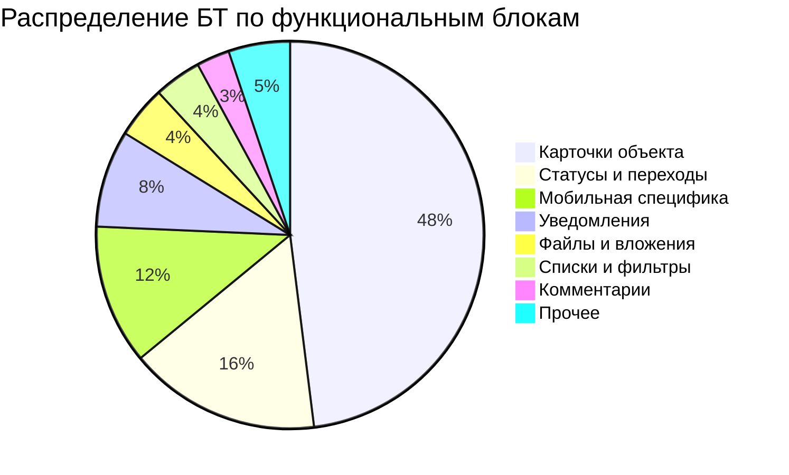

# Анализ бизнес-требований SMP Mobile по функциональным блокам

**Дата анализа:** 20.03.2026
**Всего БТ:** 506
**Источник:** БТ описание + номер.csv

---

## Сводная таблица

| Функциональный блок | Количество БТ | Доля | Номера БТ |
|-------------------|--------------|------|-----------|
| **Карточки объекта** | 243 | 48% | [см. детали ниже](#карточки-объекта) |
| **Статусы и переходы** | 81 | 16% | [см. детали ниже](#статусы-и-переходы) |
| **Мобильная специфика** | 59 | 12% | [см. детали ниже](#мобильная-специфика) |
| **Уведомления** | 41 | 8% | [см. детали ниже](#уведомления) |
| **Файлы и вложения** | 22 | 4% | [см. детали ниже](#файлы-и-вложения) |
| **Списки и фильтры** | 20 | 4% | [см. детали ниже](#списки-и-фильтры) |
| **Комментарии** | 14 | 3% | [см. детали ниже](#комментарии) |
| **Пагинация и скролл** | 4 | <1% | 524, 1356, 2406, 7855 |
| **Отчеты и аналитика** | 4 | <1% | 4210, 4224, 4227, 5584 |
| **Безопасность** | 3 | <1% | 571, 1234, 5582 |
| **UI/UX** | 2 | <1% | 5831, 7643 |
| **Типы объектов** | 1 | <1% | 570 |
| **Прочее** | 8 | 2% | 582, 4211, 4676, 4840, 5956, 7639, 7779, 8207 |

---

## Детализация по функциональным блокам

### 📄 Карточки объекта (243 БТ)

**Основные запросы клиентов:**

| Тема | Описание | Примеры БТ |
|------|----------|------------|
| **Динамические поля** | Поддержка динамических полей в МК (как в веб-версии) | 647, 7639, 8288, 4263 |
| **Маски ввода** | Поддержка масок и regex-валидации для полей | 7321 |
| **Таблицы** | Отображение таблиц в RTF-полях, масштабирование | 8207 |
| **Подписи** | Отображение подписей, поддержка тёмной темы | 7779 |
| **Связанные объекты** | Создание связанных объектов из формы, каталоги | 8253, 8256, 8262, 4263 |
| **Контекстные переменные** | Развитие контекстных переменных в МК | 4840 |
| **Шрифты/масштаб** | Поддержка крупных шрифтов (L, XL) | 5627, 8511 |
| **Тёмная тема** | Поддержка системной тёмной темы | 3290, 7779 |
| **Группы атрибутов** | Выбор группы атрибутов вместо поштучного | 8213 |
| **Сохранение данных** | Сохранение введённых данных при закрытии формы | 4825 |
| **Архивные объекты** | Визуальное выделение архивных объектов | 726 |

**Ключевая проблема:** Клиенты ожидают паритета функционала между веб-версией и МК (динамические поля, маски, связанные объекты).

---

### 🔄 Статусы и переходы (81 БТ)

**Основные запросы клиентов:**

| Тема | Описание | Примеры БТ |
|------|----------|------------|
| **Коды статусов** | Отображение кодов статусов при настройке переходов | 64, 1009 |
| **Названия статусов** | Отображение названий статусов из типа, не класса | 64 |
| **Переходы между статусами** | Удобный выбор доступных переходов | 569, 802, 803, 804 |
| **Видимость в статусе** | Скрытие атрибутов в определённых статусах | 569, 1063 |
| **Жизненный цикл** | Управление LC из МК | 2801, 3188, 4166, 4291 |
| **Быстрые действия** | Создание объектов из карточки другого объекта | 5715, 5798, 8266 |

**Ключевая проблема:** Сложность выбора правильных статусов при настройке доступных переходов.

---

### 📱 Мобильная специфика (59 БТ)

**Основные запросы клиентов:**

| Тема | Описание | Примеры БТ |
|------|----------|------------|
| **Штрих-коды/QR** | Сканер с поддержкой множественных кодов, QR-вход | 1089, 2508, 5045, 1089 |
| **Синхронизация** | Оптимизация очереди синхронизации (без мигания) | 5068 |
| **Тёмная тема** | Поддержка системной темы устройства | 3290, 1166 |
| **Геолокация** | Использование местоположения пользователя | 574 |
| **Статистика использования** | Метрики использования МК пользователями | 572, 573 |
| **Вход/выход** | Улучшение механизмов авторизации | 583, 1114, 1116, 1117 |
| **Камера/фото** | Работа с камерой, фотографиями | 1530, 3500 |
| **Навигация** | Улучшение навигационного меню | 1166 |

**Ключевая проблема:** Сканер штрих-кодов распознает случайный код при наличии нескольких рядом.

---

### 🔔 Уведомления (41 БТ)

**Основные запросы клиентов:**

| Тема | Описание | Примеры БТ |
|------|----------|------------|
| **Silent mode** | Раздельное отключение email и push-уведомлений | 559 |
| **Push-уведомления** | Кастомизация настроек push-уведомлений | 969, 1052, 1053, 1054 |
| **Email-уведомления** | Управление почтовыми уведомлениями | 1065, 1139, 1305 |
| **Центр уведомлений** | Единый центр для всех уведомлений | 699, 1591, 2012, 2206 |
| **Тестирование** | Возможность тестировать уведомления на тестовой среде | 559 |

**Ключевая проблема:** Silent mode блокирует и email, и push одновременно — нужно раздельное управление.

---

### 📎 Файлы и вложения (22 БТ)

**Основные запросы клиентов:**

| Тема | Описание | Примеры БТ |
|------|----------|------------|
| **Вращение изображений** | Автоповорот фотографий (чеки вверх ногами) | 1642 |
| **Загрузка файлов** | Удобный выбор файлов из файловой системы | 1038, 1046, 660 |
| **Скачивание файлов** | Скачивание файлов на устройство | 6215, 6551, 7630 |
| **Просмотр файлов** | Встроенный просмотрщик | 1852, 3191, 3436 |
| **Типы файлов** | Поддержка тех же типов, что в вебе | 1595, 2797, 2798, 2799 |
| **Вложения в комментариях** | Прикрепление файлов к комментариям | 5459, 8278 |

**Ключевая проблема:** Фотографии чеков приходят "вверх ногами" — нужен автоповорот по EXIF.

---

### 📋 Списки и фильтры (20 БТ)

**Основные запросы клиентов:**

| Тема | Описание | Примеры БТ |
|------|----------|------------|
| **Архивные объекты** | Отображение и работа с архивными объектами | 725, 6113 |
| **Фильтрация** | Фильтрация списков по параметрам | 62, 2107, 5079 |
| **Поиск по номеру** | Явное поле для поиска по номеру объекта | 1835 |
| **Стартовая страница** | Настройка стартовой страницы | 2376, 2424 |
| **Группы списков** | Работа с группой списков | 4676 |
| **Избранное** | Добавление списков в избранное | 5414 |

**Ключевая проблема:** Нет явного поля поиска по номеру — пользователи "вступают в ступор".

---

### 💬 Комментарии (14 БТ)

**Основные запросы клиентов:**

| Тема | Описание | Примеры БТ |
|------|----------|------------|
| **Упоминания (@mention)** | Функционал упоминаний как в вебе | 1363, 4523 |
| **Копирование текста** | Возможность скопировать часть комментария | 650 |
| **Редактирование** | Редактирование своих комментариев | 4207, 4223 |
| **UI комментарии** | Улучшение интерфейса комментариев | 667, 598, 807 |
| **Вложения** | Прикрепление файлов к комментариям | 1050, 1070, 1502 |

**Ключевая проблема:** Нет возможности скопировать часть текста из комментария.

---

## Визуализация

## Ключевые выводы

1. **Карточки объекта (48%)** — крупнейший блок. Основной запрос: паритет с веб-версией (динамические поля, маски, связанные объекты).

2. **Статусы и переходы (16%)** — важная часть бизнес-логики. Проблема с выбором статусов при настройке переходов.

3. **Мобильная специфика (12%)** — уникальные для МП требования: штрих-коды, геолокация, тёмная тема.

4. **Кросс-блоковые темы:**
   - Тёмная тема (3 блока)
   - Синхронизация (мобильная специфика)
   - Архивные объекты (карточки, списки)

## Рекомендации

| Приоритет | Действие | Обоснование |
|-----------|----------|-------------|
| 🔴 Высокий | Динамические поля в МК | 55+ БТ, запрос ключевых клиентов |
| 🔴 Высокий | Тёмная тема устройства | 3+ блока, запрос Naumen |
| 🟡 Средний | Silent mode для push отдельно | 41 БТ в блоке уведомлений |
| 🟡 Средний | Автоповорот изображений | 22 БТ в блоках файлов |
| 🟡 Средний | Упоминания в комментариях | 14 БТ, паритет с вебом |