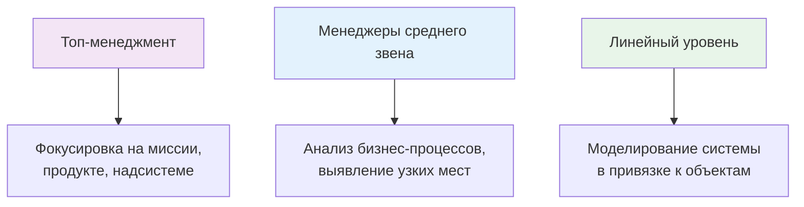

## Определение

**Теория Решения Изобретательских Задач (ТРИЗ)** — методология, возникшая в 1956 г. в СССР, представляющая собой набор эвристик (более 30 методов, алгоритмов и процедур), способствующих продуктивному творческому мышлению и созданию ранее неизвестного.

**Автор:** Г.С. Альтшуллер

**База:** анализ ~40 000 патентов для выявления общих закономерностей

---

## Ключевая идея

Творчество — не удел избранных. Оно доступно каждому. Методология позволяет:
- Снять психологическую инерцию
- Искать решения вне зависимости от специфики отрасли
- Переформулировать задачи на объективно необходимые

---

## Логика выполнения проектов

### Три этапа

1. **Анализ ситуации "как есть"** — в контекстном языке отрасли
2. **Перевод в общетехнические термины** — для поиска в максимальном поле решений
3. **Возврат к контексту** — применение найденного решения к конкретной ситуации

---

## Философия ТРИЗ

Три столпа:

| Столп | Суть |
|-------|------|
| **Идеализация** | Человеку нужна только функция, а не система. Идеальная техника занимает минимум времени, пространства и затрат |
| **Закономерности развития** | Технические системы развиваются по статистическим законам. Можно спрогнозировать следующий этап |
| **Противоречия** | Развитие возможно только через выход из зоны комфорта — выявление и устранение противоречий |

---

## Когда применять

| Ситуация | Применение |
|----------|------------|
| **Комплексный анализ** бизнес-процессов и продуктов |
| **Выявление проблем** и постановка локальных задач |
| **Моделирование решений** через оптимизацию, реинжиниринг или создание нового |
| **Подготовка ТЗ** для конструкторской/инженерной проработки |

---

## Применение по уровням

---

## Ключевые инструменты

- Алгоритм решения изобретательских задач (АРИЗ)
- Таблица противоречий
- Матрица из 40 изобретательных приёмов
- Стандарты на решение изобретательских задач
- Законы развития технических систем

---

## Связанные понятия

- [[50_KNOWLEDGE/glossary/|...]]
- [[50_KNOWLEDGE/methodology/|...]]

---

## Источники

- [Хабр: Что такое ТРИЗ?](https://habr.com/ru/articles/659939/)
- Международная Ассоциация ТРИЗ (МА ТРИЗ, Knoxville, TN USA)
