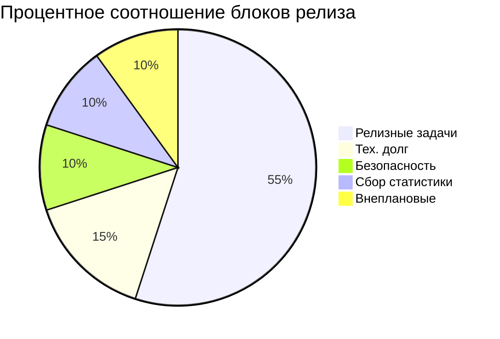
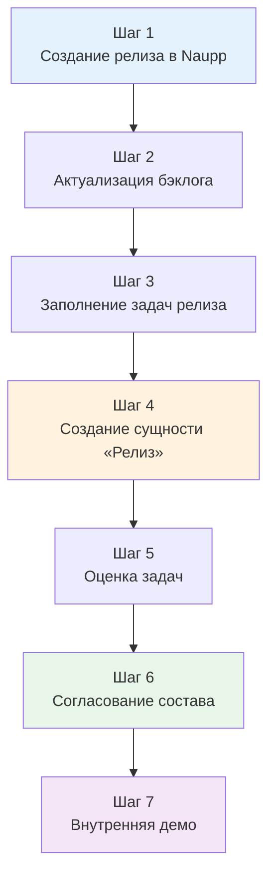

# Процесс релиза мобильных приложений

## Назначение

Документ описывает и визуализирует работы с релизом с целью **прозрачности и разграничения процесса**. Полезно для:
- Новых сотрудников — быстрая интеграция
- Current team — заполнение пробелов в понимании
- Вендоров и стейкхолдеров — понимание состава релиза

---

## Команда релиза

| Роль | Ответственный |
|------|---------------|
| **Продакт** | [[10_PEOPLE/epodkin/epodkin|Подкин Евгений]] |
| **Релиз-менеджер** | [[10_PEOPLE/epodkin/epodkin|Подкин Евгений]] |
| **Тимлид аналитики** | [[10_PEOPLE/ibelova/ibelova|Белова Ирина]] |
| **Тимлид Android** | [[10_PEOPLE/iportnov/iportnov|Портнов Иван]] |
| **Тимлид iOS** | [[10_PEOPLE/sprokopiev/sprokopiev|Прокопьев Сергей]] |
| **Тимлид тестирования** | Лукьянова Алёна |
| **Куратор документации** | [[10_PEOPLE/dtimganova/dtimganova|Тимганова Дарья]] |

---

## Структура релиза

> **Важно:** После каждого релиза проверять актуальность значений для корректировки следующего релиза — состав команды меняется, разработчики растут.

---

## Процесс

---

## Детальное описание этапов

### Шаг 1. Создание релиза в Naupp

| Ответственный | Действия |
|---------------|----------|
| **Продакт** | Создаёт новый релиз в Naupp сразу после текущего релиза |

**Результат:** Релиз в Naupp с функциональными блоками

---

### Шаг 2. Актуализация бэклога

| Ответственный | Действия |
|---------------|----------|
| **Продакт** | Формирует список задач на следующий релиз |

**Составляющие планирования:**

| Источник | Действия |
|----------|----------|
| **Синхронизация с вендорами** | Аналитики рассказывают о предыдущем релизе, собирают пожелания → фиксация в бэклоге аналитики |
| **Обход бизнес-требований в Naupp** | Продакт выделяет частые пожелания → добавление в бэклог аналитики |
| **Проработка бэклога аналитики** | • Задачи с Сервер/API → в план разработки платформы (SMP) • Готовые задачи (клиент или Сервер/API готов) → планирование в релиз |
| **Проработка бэклога безопасности** | Продакт выбирает приоритетные задачи → добавление в бэклог аналитики |
| **Планирование тех. долга** | Тимлиды подготавливают список + оценки + ценность → приоритизация с продактом и релиз-менеджером |

---

### Шаг 3. Заполнение задач релиза

| Ответственный | Действия |
|---------------|----------|
| **Продакт** | Заполняет задачи релиза в Naupp |

**Цель:** Верхнеуровневое ознакомление сторонних команд и вендоров с составом релиза

---

### Шаг 4. Создание сущности «Релиз»

| Ответственный | Действия |
|---------------|----------|
| **Продакт** | • Переносит список в Naupp как сущность «Релиз» • Проставляет связи со всеми задачами • Распределяет задачи на разработчиков (с тимлидами, с учётом интересов) • Проставляет срок на карточке релиза |

**Пример:** Релиз 13

---

### Шаг 5. Оценка задач

| Ответственный | Действия |
|---------------|----------|
| **Продакт** | Переводит задачи на оценку тимлидам разработки |
| **Тимлиды разработки** | Проставляют оценку, возвращают в статус «Зарегистрирована» |

---

### Шаг 6. Согласование состава релиза

| Ответственный | Действия |
|---------------|----------|
| **Продакт** | • Согласовывает состав с тимлидами разработки (учитывает ресурсы) • Демонстрирует состав стейкхолдерам • Учитывает пожелания стейкхолдеров |

---

### Шаг 7. Внутренняя демо

| Ответственный | Подготовка | Проведение |
|---------------|------------|------------|
| **Продакт** | • Готовит презентацию (задачи + ценности + кейсы) • Назначает встречу • Оповещает аналитиков для подготовки | • Проводит демо • Делает запись для отсутствующих • Загружает в хранилище |
| **Аналитики** | Готовятся к рассказу о сути своих задач | Рассказывают о своих задачах |

**Артефакты:** Презентация, запись встречи

---

## Инструменты

| Инструмент | Назначение |
|------------|-----------|
| **Naupp** | Управление релизами, задачами, связями |
| **SMP** | План разработки платформы (Server/API) |

---

## Связанные документы

- [[60_DOMAIN/mobile/architecture|Архитектура мобильных приложений]]
- [[50_KNOWLEDGE/processes/|Другие процессы]]
